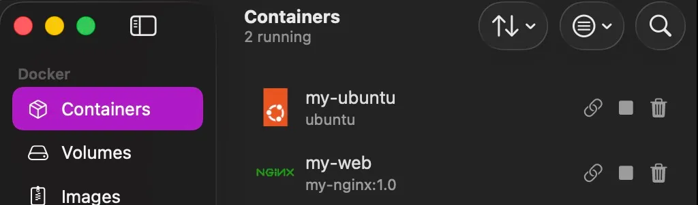
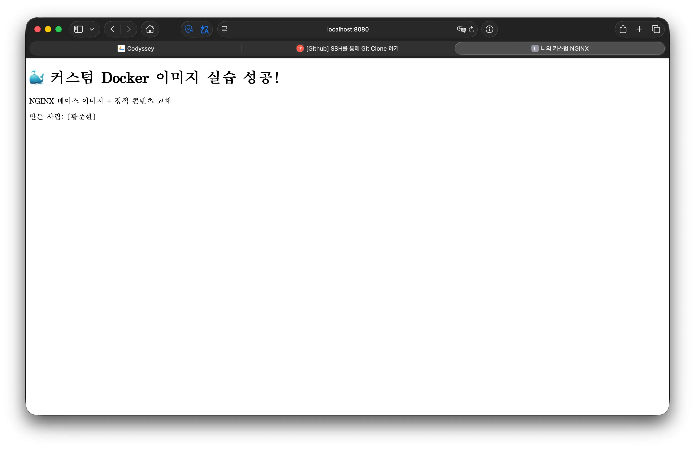
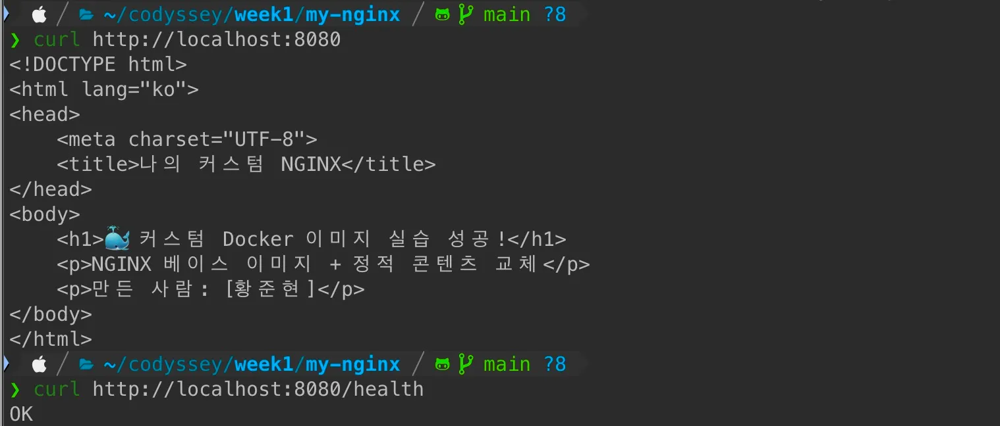
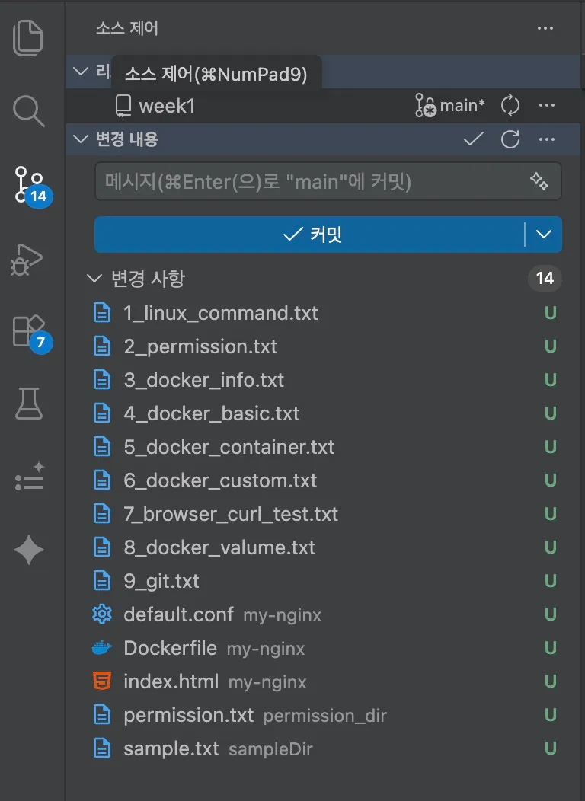

# 미션 : 내 컴퓨터에 개발자용 '작업실' 꾸미기

이 미션은 개발 환경을 직접 구축하고 검증하는 경험을 목표로 합니다.

터미널, Docker, Git/GitHub를 사용해 로컬 개발 환경을 세팅하고, 컨테이너 실행/관리, 웹 서버 컨테이너화, 포트 매핑, 바인드 마운트/볼륨을 통해 변경 반영과 데이터 영속성을 직접 확인합니다.

## 과제 목표

- 절대 경로와 상대 경로의 차이를 예시를 들어 설명할 수 있다.
- 파일 권한의 의미(r/w/x)와 755, 644 같은 표기가 어떤 규칙으로 해석되는지 설명할 수 있다.
- 기존 Dockerfile을 기반으로 “커스텀 이미지”를 만들 수 있다.
- 포트 매핑이 필요한 이유를 설명할 수 있다.
- Docker 볼륨(영속 데이터)을 설명할 수 있다.
- Git과 GitHub의 역할 차이(로컬 버전관리 vs 원격 협업 플랫폼)를 설명할 수 있다.

## 실행 환경

- OS: MacOS
- Shell: zsh
- Docker: 29.4.0
- Git: 2.33.0

## 수행 리스트

### 1. 터미널 기본 조작 및 폴더 구성

[1_linux_command.log](logs/1_linux_command.log)

- 현재 위치 확인

```bash
❯ pwd
/Users/junhyun/codyssey
```

- 목록 확인(숨김 파일 포함)

```bash
❯ ls -al
total 0
drwxr-xr-x@   2 junhyun  staff    64  7월 27 19:16 .
drwxr-x---+ 102 junhyun  staff  3264  7월 27 19:18 ..
```

- 이동(디렉터리 이동)

```bash
❯ cd week1
❯ pwd
/Users/junhyun/codyssey/week1
```

> 💡 **경로 선택 기준 (호스트 vs 컨테이너)**
> - **호스트 환경**: 내 컴퓨터의 특정 위치를 명확하게 지목해야 할 때는 **절대 경로**(`/Users/...`)를 사용하고, 현재 작업 중인 폴더 안에서 빠르게 이동하거나 소스 코드를 참조할 때는 편한 **상대 경로**(`cd week1`)를 선택합니다.
> - **컨테이너/스크립트 환경**: 실행 환경이 바뀌어도 항상 똑같이 동작하는 **재현성**이 중요하므로, Dockerfile이나 스크립트를 작성할 때는 컨테이너 내부의 기준 **절대 경로**(`/app`, `/usr/share/nginx/html` 등)를 고정으로 사용하거나 작업 디렉터리(`WORKDIR`) 기준의 **상대 경로**로 명확히 통일해서 작성합니다.

- 빈 파일 생성

```bash
❯ touch sample.txt
```

- 복사

```bash
❯ cp sample.txt copied.txt
```

- 이동/이름변경(파일 이동 & 이름 변경)

```bash
❯ mkdir sampleDir
❯ mv sample.txt sampleDir
❯ mv sample.txt change_name.txt
```

- 파일 삭제

```bash
❯ rm change_name.txt
```

- 파일 내용 확인

```bash
❯ cat sample.txt
This is sample file
```

### 2. 권한 변경 실습

[2_permission.log](logs/2_permission.log)

변경 전

```bash
❯ mkdir permission_dir
❯ touch permission.txt

❯ ls -al
total 0
drwxr-xr-x  3 junhyun  staff   96 Jul 28 10:56 .
drwxr-xr-x@ 8 junhyun  staff  256 Jul 28 10:55 ..
-rw-r--r--  1 junhyun  staff    0 Jul 28 10:56 permission.txt
```

변경 후

**파일 권한 변경:** 읽기/쓰기(`644`)에서 모든 사용자 읽기전용(`444`)으로 변경

**디렉토리 권한 변경:** 기본 권한(`755`)에서 소유자만 모든 권한을 갖도록(`700`) 변경

```bash
❯ chmod 444 permission.txt
❯ chmod 700 .

❯ ls -al
total 0
drwx------  3 junhyun  staff   96 Jul 28 10:56 .
drwxr-xr-x@ 8 junhyun  staff  256 Jul 28 10:55 ..
-r--r--r--  1 junhyun  staff    0 Jul 28 10:56 permission.txt
```

> 💡 **rwx 권한 비트 계산 방식 (숫자-권한 비트 매핑)**
> 리눅스 권한 숫자(예: `755`, `644`)는 왼쪽부터 **[소유자(User)] - [그룹(Group)] - [기타 사용자(Others)]**의 3단계로 매핑됩니다. 각 자리는 읽기(`r`=4), 쓰기(`w`=2), 실행(`x`=1) 비트의 합으로 계산합니다.
> - **`644` (`-rw-r--r--`) 계산 예시**:
>   - 소유자: `6` (`4(r) + 2(w) + 0` = `rw-`, 읽기/쓰기 가능)
>   - 그룹: `4` (`4(r) + 0 + 0` = `r--`, 읽기 전용)
>   - 기타: `4` (`4(r) + 0 + 0` = `r--`, 읽기 전용)
> - **`755` (`drwxr-xr-x`) 계산 예시**:
>   - 소유자: `7` (`4(r) + 2(w) + 1(x)` = `rwx`, 모든 권한)
>   - 그룹: `5` (`4(r) + 0 + 1(x)` = `r-x`, 읽기/실행 가능)
>   - 기타: `5` (`4(r) + 0 + 1(x)` = `r-x`, 읽기/실행 가능)
> *(참고: 디렉터리에서의 `x`(실행) 권한은 '폴더 내부로 접근/진입(`cd`)할 수 있는 권한'을 의미하여, `700`으로 바꾸면 소유자 외 다른 사용자는 해당 폴더 진입이 제한됩니다.)*

### 3. Docker 설치/점검

[3_docker_info.log](logs/3_docker_info.log)

```bash
❯ docker --version
Docker version 29.4.0, build 9d7ad9f
```

```bash
❯ docker info
Client:
 Version:    29.4.0
 Context:    orbstack
 Debug Mode: false

 # 중략...

WARNING: DOCKER_INSECURE_NO_IPTABLES_RAW is set
```

### 4. Docker 기본 운영 명령 수행

[4_docker_basic.log](logs/4_docker_basic.log)

- 이미지: 다운로드/목록 확인 (예: `docker images`)

```bash
❯ docker images
                                                                                              i Info →   U  In Use
IMAGE                                                   ID             DISK USAGE   CONTENT SIZE   EXTRA
ubuntu:latest                                           9238bf8bb4a4        120MB             0B    U                                                                                                         i Info →   U  In Us
```

- 컨테이너: 실행/중지/목록 확인 (예: `docker ps`, `docker ps -a`)

```bash
❯ docker ps
CONTAINER ID   IMAGE     COMMAND   CREATED        STATUS        PORTS     NAMES
ac294328bab0   ubuntu    "bash"    14 hours ago   Up 14 hours             my-ubuntu
```

- 운영: 로그 확인 (예: `docker logs`), 리소스 확인 (예: `docker stats`)

```bash
❯ docker logs --tail 10 my-ubuntu
root@ac294328bab0:/# exit
exit

❯ docker stats
CONTAINER ID   NAME        CPU %     MEM USAGE / LIMIT     MEM %     NET I/O         BLOCK I/O     PIDS
ac294328bab0   my-ubuntu   0.00%     1.367MiB / 7.818GiB   0.02%     1.13kB / 126B   19.2MB / 0B   1
```

### 5. 컨테이너 실행 실습

[5_docker_container.log](logs/5_docker_container.log)

- `hello-world` 실행 성공을 기록한다. (이미지가 없는 경우 docker hub에서 자동으로 pull 한다.)

```bash
❯ docker run hello-world
Unable to find image 'hello-world:latest' locally
latest: Pulling from library/hello-world
58dee6a49ef1: Pull complete
Digest: sha256:c3cbe1cc1aa588a64951ac6286e0df7b27fe2e6324b1001c619bb358770c0178
Status: Downloaded newer image for hello-world:latest

Hello from Docker!
This message shows that your installation appears to be working correctly.

To generate this message, Docker took the following steps:
 1. The Docker client contacted the Docker daemon.
 2. The Docker daemon pulled the "hello-world" image from the Docker Hub.
    (arm64v8)
 3. The Docker daemon created a new container from that image which runs the
    executable that produces the output you are currently reading.
 4. The Docker daemon streamed that output to the Docker client, which sent it
    to your terminal.

To try something more ambitious, you can run an Ubuntu container with:
 $ docker run -it ubuntu bash

Share images, automate workflows, and more with a free Docker ID:
 https://hub.docker.com/

For more examples and ideas, visit:
 https://docs.docker.com/get-started/
```

> **💡 [참고] 이미지의 불변성(Immutability)과 컨테이너의 변경·커밋(Commit) 관점**
> 도커 이미지는 내용이 변경되지 않는 불변(Read-Only) 레이어 구조이며, 컨테이너 실행 시 그 위에 독립적인 읽기-쓰기(Writable) 레이어가 할당되어 `ubuntu` 컨테이너에 패키지를 설치하더라도 원본 이미지는 변경되지 않습니다.
> 컨테이너에서 일어난 이러한 변경 사항을 영구히 보존하려면 `docker commit` 명령을 사용하여 변경분을 포함하는 새로운 불변 이미지를 생성해야 합니다.

- `ubuntu` 컨테이너를 실행하고 내부 진입 후 간단 명령(예: `ls`, `echo`) 수행 결과를 기록한다.
  - `i`: 상호작용(Interactive) 모드를 유지합니다.
  - `t`: 가상 터미널(TTY)을 할당하여 명령어를 입력할 수 있게 해줍니다.
  - `bash`: 컨테이너가 실행될 때 실행할 쉘(Shell) 프로그램입니다.

```bash
❯ docker run -it ubuntu bash
Unable to find image 'ubuntu:latest' locally
latest: Pulling from library/ubuntu
55237ac9880d: Pull complete
693710ba2039: Pull complete
Digest: sha256:3131b4cc82a783df6c9df078f86e01819a13594b865c2cad47bd1bca2b7063bb
Status: Downloaded newer image for ubuntu:latest
root@05a67ab3a96c:/# ls
bin  boot  dev  etc  home  lib  media  mnt  opt  proc  root  run  sbin  srv  sys  tmp  usr  var
root@05a67ab3a96c:/# echo hello
hello
```

- 컨테이너 종료/유지(attach/exec 등)의 차이를 스스로 관찰하고 간단히 정리한다.
  - `attach`: 컨테이너가 처음 실행될 때의 메인 프로세스에 직접 연결한다. exit을 할 경우 컨테이너가 종료된다.

  ```bash
  ❯ docker run -it -d --name my-ubuntu ubuntu bash
  ac294328bab05a5e3ab8ad1fa97a705e4f49d583fccb9bb14f2ddae6d5ec8fb9

  ❯ docker ps
  CONTAINER ID   IMAGE     COMMAND   CREATED         STATUS         PORTS     NAMES
  ac294328bab0   ubuntu    "bash"    4 seconds ago   Up 3 seconds             my-ubuntu

  ❯ docker attach my-ubuntu
  exit
  exit

  ❯ docker ps
  CONTAINER ID   IMAGE     COMMAND   CREATED   STATUS    PORTS     NAMES
  ```

  - `exec`: 컨테이너 내부에 새로운 프로세스(bash)를 생성하여 접속한다. exit을 할 경우 컨테이너가 종료되지 않고 계속 실행된다. (새로 만든 프로세스만 종료되고 메인 프로세스는 유지되는 중)

  ```bash
  ❯ docker start my-ubuntu
  my-ubuntu

  ❯ docker exec -it my-ubuntu bash
  root@ac294328bab0:/# exit
  exit

  ❯ docker ps
  CONTAINER ID   IMAGE     COMMAND   CREATED         STATUS          PORTS     NAMES
  ac294328bab0   ubuntu    "bash"    8 minutes ago   Up 21 seconds             my-ubuntu
  ```

### 6. 기존 Dockerfile 기반 커스텀 이미지 제작

[6_docker_custom.log](logs/6_docker_custom.log)

(A) 웹 서버 베이스 이미지 활용(예: NGINX/Apache 등) + 정적 콘텐츠/설정만 교체

1. 프로젝트 폴더 구성

   ```bash
   my-nginx/
   ├── Dockerfile
   ├── index.html        # 교체할 정적 콘텐츠
   └── default.conf      # 교체할 NGINX 설정
   ```

2. 정적 콘텐츠 만들기

   ```bash
   ❯ vi index.html

   <!DOCTYPE html>
   <html lang="ko">
   <head>
       <meta charset="UTF-8">
       <title>나의 커스텀 NGINX</title>
   </head>
   <body>
       <h1>🐳 커스텀 Docker 이미지 실습 성공!</h1>
       <p>NGINX 베이스 이미지 + 정적 콘텐츠 교체</p>
       <p>만든 사람: [본인 이름]</p>
   </body>
   </html>
   ```

3. nginx 설정 파일 만들기

   ```bash
   ❯ vi default.conf

   server {
       listen       80;
       server_name  localhost;

       location / {
           root   /usr/share/nginx/html;
           index  index.html;
       }

       # 커스텀 포인트: 상태 확인용 엔드포인트 추가
       location /health {
           return 200 "OK\n";
       }
   }
   ```

4. Dockerfile 작성

   ```bash
   ❯ vi Dockerfile

   # 1. 기존 베이스 이미지 선택 (공식 NGINX, alpine은 가벼운 버전)
   FROM nginx:alpine

   # 2. 기본 설정 파일을 내 설정으로 교체
   COPY default.conf /etc/nginx/conf.d/default.conf

   # 3. 기본 HTML을 내 정적 콘텐츠로 교체
   COPY index.html /usr/share/nginx/html/index.html

   # 4. 80번 포트를 사용함을 명시 (문서화 목적)
   EXPOSE 80
   ```

5. 빌드 & 실행

   ```bash
   # 1. 이미지 빌드 (마지막 점(.)은 "현재 폴더의 Dockerfile 사용"이라는 뜻!)
   ❯ docker build -t my-nginx:1.0 .

   # 2. 빌드 성공 확인
   ❯ docker images

   # 3. 컨테이너 실행 (내 PC의 8080포트 → 컨테이너의 80포트 연결)
   ❯ docker run -d -p 8080:80 --name my-web my-nginx:1.0

   # 4. 실행 확인
   ❯ docker ps
   ```

- 선택한 기존 베이스
  공식 `nginx:alpine` 이미지를 선택. 이유: 검증된 공식 이미지이며, alpine 기반이라 용량이 작고 빌드가 빠름.
- 커스텀 포인트와 목적
  | 커스텀 포인트 | 목적 |
  | ------------------- | --------------------------------------------------------- |
  | `index.html` 교체 | 기본 환영 페이지 대신 나만의 정적 콘텐츠 제공 |
  | `default.conf` 교체 | 서버 설정 직접 관리 + `/health` 상태 확인 엔드포인트 추가 |
  | `EXPOSE 80` 명시 | 이미지 사용자가 포트 정보를 알 수 있도록 문서화 |
- 빌드/실행 명령 + 핵심 결과(출력/스크린샷)

  ```bash
  ❯ docker build -t my-nginx:1.0 .

  [+] Building 8.0s (8/8) FINISHED                                                                                                docker:orbstack
   => [internal] load build definition from Dockerfile                                                                                       0.0s
   => => transferring dockerfile: 414B                                                                                                       0.0s
   => [internal] load metadata for docker.io/library/nginx:alpine                                                                            3.5s
   => [internal] load .dockerignore                                                                                                          0.0s
   => => transferring context: 2B                                                                                                            0.0s
   => [1/3] FROM docker.io/library/nginx:alpine@sha256:4a73073bd557c65b759505da037898b61f1be6cbcc3c2c3aeac22d2a470c1752                      4.2s
   => => resolve docker.io/library/nginx:alpine@sha256:4a73073bd557c65b759505da037898b61f1be6cbcc3c2c3aeac22d2a470c1752                      0.0s
   => => sha256:5de55e5ef9c033997441461efe7ba23a986db059c0bb78b38f84ee0d72b99167 4.18MB / 4.18MB                                             1.1s
   => => sha256:7b1fb50ff9dc606dba8c8c0e8eb4e98c650c5b289506f01724309ebf71a69d45 1.91MB / 1.91MB                                             1.4s
   => => sha256:e42993d4c6ecb26b388e945cbe5f03be1f7858226750c1f8375883db2aae1243 626B / 626B                                                 1.1s
   => => sha256:4a73073bd557c65b759505da037898b61f1be6cbcc3c2c3aeac22d2a470c1752 10.33kB / 10.33kB                                           0.0s
   => => sha256:1dd3048a04f4b76ebd706c1bbb9df7d9d53b4f8253b32ce14467088c9b5ada0f 2.50kB / 2.50kB                                             0.0s
   => => sha256:28c4e91555d001bb0f6b2796e565bfa75302711a0d6e67c5562eb2f7d54d2483 12.34kB / 12.34kB                                           0.0s
   => => extracting sha256:5de55e5ef9c033997441461efe7ba23a986db059c0bb78b38f84ee0d72b99167                                                  0.1s
   => => sha256:d0e9565ba4ff139c848073b3358bb2c9b31a93cb9b744a5b0903b22f5a3ddc0f 956B / 956B                                                 1.4s
   => => sha256:c4a042f5cf717d2e64d2176a41624344a2f1ad0475f6ac6dae092aefbbd07b37 405B / 405B                                                 1.4s
   => => extracting sha256:7b1fb50ff9dc606dba8c8c0e8eb4e98c650c5b289506f01724309ebf71a69d45                                                  0.0s
   => => sha256:e1f13a453c9dd406f331a3efefeb846cd18b068d73177c0d57c6f3d5169eacb4 1.21kB / 1.21kB                                             1.8s
   => => sha256:ba4be3b26f08037fa63337d7a425d3253b887bff559447733e71759f65b0f8c8 1.40kB / 1.40kB                                             1.8s
   => => sha256:977aedb192ade9f4f62ce4c6df02d8f62abe1e8710e006854398f8a7cda030e7 19.85MB / 19.85MB                                           3.7s
   => => extracting sha256:e42993d4c6ecb26b388e945cbe5f03be1f7858226750c1f8375883db2aae1243                                                  0.0s
   => => extracting sha256:d0e9565ba4ff139c848073b3358bb2c9b31a93cb9b744a5b0903b22f5a3ddc0f                                                  0.0s
   => => extracting sha256:c4a042f5cf717d2e64d2176a41624344a2f1ad0475f6ac6dae092aefbbd07b37                                                  0.0s
   => => extracting sha256:e1f13a453c9dd406f331a3efefeb846cd18b068d73177c0d57c6f3d5169eacb4                                                  0.0s
   => => extracting sha256:ba4be3b26f08037fa63337d7a425d3253b887bff559447733e71759f65b0f8c8                                                  0.0s
   => => extracting sha256:977aedb192ade9f4f62ce4c6df02d8f62abe1e8710e006854398f8a7cda030e7                                                  0.2s
   => [internal] load build context                                                                                                          0.1s
   => => transferring context: 656B                                                                                                          0.0s
   => [2/3] COPY default.conf /etc/nginx/conf.d/default.conf                                                                                 0.1s
   => [3/3] COPY index.html /usr/share/nginx/html/index.html                                                                                 0.0s
   => exporting to image                                                                                                                     0.0s
   => => exporting layers                                                                                                                    0.0s
   => => writing image sha256:1219914c9dd17d8675aab4efa93656c24cd1885c35803bd508530084a4963f70                                               0.0s
   => => naming to docker.io/library/my-nginx:1.0                                                                                            0.0s
  View build details: docker-desktop://dashboard/build/orbstack/orbstack/pb7dhqa6snq46v4kp3cv5rzdw

  ❯ docker images
                                                                                                                             i Info →   U  In Use
  IMAGE                                                   ID             DISK USAGE   CONTENT SIZE   EXTRA
  hello-world:latest                                      eb84fdc6f2a3        5.2kB             0B    U
  my-nginx:1.0                                            1219914c9dd1       61.8MB             0B
  ubuntu:latest                                           9238bf8bb4a4        120MB             0B    U

  ❯ docker run -d -p 8080:80 --name my-web my-nginx:1.0
  aecbdf739a8826a3cd0dbeb1508b519e8be1a87633a2bfbd9ecfd3a946a05170

  ❯ docker ps
  CONTAINER ID   IMAGE          COMMAND                   CREATED          STATUS          PORTS                                     NAMES
  aecbdf739a88   my-nginx:1.0   "/docker-entrypoint.…"   4 seconds ago    Up 4 seconds    0.0.0.0:8080->80/tcp, [::]:8080->80/tcp   my-web
  c33b1f4de13f   ubuntu         "bash"                    15 minutes ago   Up 15 minutes                                             my-ubuntu
  ```

  

### 7. 포트 매핑 및 접속

[7_browser_curl_test.log](logs/7_browser_curl_test.log)




> 💡 **네임스페이스와 포트 노출 및 보안 관점**
> - **네트워크 네임스페이스(Network Namespace) 격리**: 도커 컨테이너는 독립된 네트워크 공간(Namespace)을 가지므로, 컨테이너 내부의 80번 포트는 기본적으로 호스트(내 컴퓨터)나 외부 망과 격리되어 접근할 수 없습니다. 따라서 외부 접속을 수신하기 위해 호스트 포트와 컨테이너 포트를 연결해 주는 포트 바인딩(`-p 8080:80`)이 필요합니다.
> - **방화벽 및 보안 주의점**: `-p 8080:80`으로 바인딩할 경우 호스트의 8080 포트가 외부에 노출됩니다. 이때 호스트 OS의 방화벽 설정이나 Cloud 보안 그룹(Security Group)에서 해당 포트가 허용되어 있어야 접근이 가능합니다. 실무에서는 불필요한 포트를 외부(`0.0.0.0`)로 오버 노출하지 않도록 주의하고, 필요한 포트만 최소한으로 공개하거나 서브넷 내 내부망(Bridge/Internal Network)으로 보호하는 보안 조치가 요구됩니다.

### 8. Docker 볼륨 영속성

[8_docker_valume.log](logs/8_docker_valume.log)

1. 볼륨 생성

   ```bash
   ❯ docker volume create my-data # 볼륨 생성

   ❯ docker volume ls
   DRIVER    VOLUME NAME
   local     my-data # 볼륨 생성 확인
   ```

2. 컨테이너에 볼륨 연결 + 테스트 데이터 작성

   | 옵션                | 의미                                               |
   | ------------------- | -------------------------------------------------- |
   | `-v my-data:/data`  | `my-data` 볼륨을 컨테이너 안의 `/data` 폴더에 연결 |
   | `--name container1` | 컨테이너 이름 지정 (관리 편의)                     |

   ```bash
   ❯ docker run -it --name container1 -v my-data:/data ubuntu bash

   root@e93ba0ed6ec2:/# echo "이 데이터는 살아남을까요? - $(date)" > /data/test.txt
   root@e93ba0ed6ec2:/# cat /data/test.txt
   이 데이터는 살아남을까요? - Tue Jul 28 02:48:32 UTC 2026
   root@e93ba0ed6ec2:/# exit
   exit
   ```

3. 컨테이너 삭제

   ```bash
   ❯ docker rm container1
   container1

   ❯ docker ps
   CONTAINER ID   IMAGE          COMMAND                   CREATED          STATUS          PORTS                                     NAMES
   aecbdf739a88   my-nginx:1.0   "/docker-entrypoint.…"   23 minutes ago   Up 23 minutes   0.0.0.0:8080->80/tcp, [::]:8080->80/tcp   my-web
   c33b1f4de13f   ubuntu         "bash"                    39 minutes ago   Up 39 minutes                                             my-ubuntu
   ```

4. 새 컨테이너로 데이터 생존 확인

   ```bash
   ❯ docker run -it --name container2 -v my-data:/data ubuntu bash

   root@e8382621d9f8:/# cat /data/test.txt
   이 데이터는 살아남을까요? - Tue Jul 28 02:48:32 UTC 2026
   root@e8382621d9f8:/# exit
   exit
   ```

> 💡 **바인드 마운트(Bind Mount) 예시 및 볼륨 백업/복원 절차**
> 
> **1) 바인드 마운트(Bind Mount) 사용 예시**
> Docker 볼륨이 Docker 관리 영역에 데이터를 저장하는 방식이라면, **바인드 마운트**는 호스트 컴퓨터의 특정 절대 경로 폴더를 컨테이너 내부로 직접 연결합니다. 로컬 소스 코드를 수정하면 컨테이너에 즉시 반영되는 개발 환경에서 주로 활용됩니다.
> ```bash
> # 호스트의 /Users/junhyun/codyssey/week1/html 폴더를 컨테이너의 Nginx 웹 루트로 마운트
> ❯ docker run -d -p 8082:80 -v /Users/junhyun/codyssey/week1/html:/usr/share/nginx/html --name bind-web nginx
> ```
> 
> **2) Docker 볼륨 백업 및 복원 절차 (일회성 컨테이너 활용)**
> Docker 볼륨(`my-data`) 내부 데이터를 백업하거나 다른 시스템으로 복원할 때, 임시 컨테이너(`--rm`)와 `tar` 명령을 조합하여 안전하게 백업 및 복구할 수 있습니다.
> 
> * **볼륨 정기 백업 (Backup)**: `my-data` 볼륨 내용을 압축(`backup.tar.gz`)하여 호스트의 현재 폴더로 추출
>   ```bash
>   ❯ docker run --rm -v my-data:/data -v $(pwd):/backup ubuntu tar cvzf /backup/backup.tar.gz -C /data .
>   ```
> * **볼륨 데이터 복원 (Restore)**: 압축 파일을 새 볼륨(`my-data-restore`)으로 풀어서 복구
>   ```bash
>   ❯ docker volume create my-data-restore
>   ❯ docker run --rm -v my-data-restore:/data -v $(pwd):/backup ubuntu tar xvzf /backup/backup.tar.gz -C /data
>   ```

### 9. Git 설정 및 VSCode GitHub 연동

[9_git_github.log](logs/9_git_github.log)

```bash
❯ git config --list

user.name=JunHyun
user.email=junhyun1001@gmail.com
init.defaultbranch=main

❯ git remote -v
origin	git@github.com:jjunhyun/week1.git (fetch)
origin	git@github.com:jjunhyun/week1.git (push)

❯ git push                                                          
Enumerating objects: 28, done.
Counting objects: 100% (28/28), done.
Delta compression using up to 10 threads
Compressing objects: 100% (22/22), done.
Writing objects: 100% (26/26), 966.60 KiB | 5.82 MiB/s, done.
Total 26 (delta 2), reused 0 (delta 0), pack-reused 0
remote: Resolving deltas: 100% (2/2), done.
To github.com:jjunhyun/week1.git
   a66fb5a..dc5124d  main -> main
```



### 트러블 슈팅

**1. SSH 클론 오류 트러블슈팅**

**문제**
SSH로 GitHub 저장소를 클론하려 했지만 Permission denied (publickey) 오류가 발생했다.

```bash
git clone git@github.com:jjunhyun/week1.git
```

**원인**
ssh-keygen으로 생성한 키 파일 이름을 임의로 바꿔서, SSH가 기본 키 이름(id_ed25519 등)을 찾지 못했다.

**확인**
~/.ssh 디렉토리를 확인한 결과, 키 파일이 기본 이름이 아닌 다른 이름으로 저장되어 있었다.

**해결**
키 파일 이름을 원래 이름으로 복구한 뒤 ssh -T git@github.com으로 인증을 확인했고, 이후 git clone이 정상 동작했다.

---

**2. Docker 컨테이너 이름 충돌로 인한 실행 실패**

**문제**
볼륨을 연결한 컨테이너를 실행하려 했지만, 기존 컨테이너 이름과 충돌하여 생성에 실패했다.

```bash
docker run -it --name container1 -v my-data:/data ubuntu bash
```

오류 메시지:

```bash
docker: Error response from daemon: Conflict. The container name "/container1" is already in use ...
```

**원인**
이전에 생성한 container1이 삭제되지 않고 중지 상태로 남아 있어 이름을 계속 점유하고 있었다.
즉, exit는 컨테이너를 종료할 뿐 삭제하지는 않는다.

**확인**

```bash
docker ps -a
```

결과에서 container1이 Exited 상태로 존재하는 것을 확인했다.

```bash
CONTAINER ID IMAGE COMMAND STATUS NAMES
a019e54f56ba ubuntu "bash" Exited (0) container1
```

**해결**

기존 컨테이너를 삭제한 뒤 다시 실행했다.

```bash
docker rm container1
docker run -it --name container1 -v my-data:/data ubuntu bash
```

---

**3. 웹 서버 실행 시 포트 충돌(Port Conflict) 진단 및 단계별 해결**

**문제**
컨테이너를 실행할 때 특정 포트(예: 8080)가 이미 다른 프로세스에서 사용 중이어서 실행이 실패하거나 `bind: address already in use` 오류 메시지가 발생했다.

```bash
docker run -d -p 8080:80 --name my-web my-nginx:1.0
```

오류 메시지 예시:
```bash
docker: Error response from daemon: driver failed programming external connectivity on endpoint my-web: Bind for 0.0.0.0:8080 failed: port is already allocated.
```

**원인**
호스트 OS(내 컴퓨터)에서 8080 포트를 기존 웹 서비스나 백그라운드 프로세스가 점유하고 있어 도커 데몬이 포트를 바인딩할 수 없었다.

**단계별 진단 및 해결 방법**

1. **1단계: 충돌 포트 점유 상태 확인 (`lsof` / `ss` / `netstat`)**
   어떤 포트가 활성화되어 있고, 8080 포트를 어떤 프로세스가 잡고 있는지 확인했다.
   ```bash
   ❯ lsof -i :8080
   COMMAND   PID    USER   FD   TYPE DEVICE SIZE/OFF NODE NAME
   java     12345 junhyun  40u  IPv6 0x1234      0t0  TCP *:http-alt (LISTEN)
   
   # 참고: 리눅스 환경의 경우 ss나 netstat 명령 활용 가능
   ❯ ss -tulpn | grep 8080
   ❯ netstat -anv | grep 8080
   ```

2. **2단계: 점유 프로세스 상세 확인 (`ps`)**
   포트를 점유 중인 PID(`12345`)의 실행 경로 및 상세 프로세스 정보를 조회했다.
   ```bash
   ❯ ps -ef | grep 12345
   junhyun 12345 1 0 10:00ttys000 0:01.20 java -jar sample-app.jar
   ```

3. **3단계: 프로세스 종료 또는 실행 포트 변경하여 재실행**
   - **방법 A (프로세스 종료)**: 더 이상 필요 없는 테스트 프로세스라면 PID를 지정하여 종료 후 재실행한다.
     ```bash
     ❯ kill -9 12345
     ❯ docker run -d -p 8080:80 --name my-web my-nginx:1.0
     ```
   - **방법 B (포트 변경 실행)**: 해당 프로세스를 유지해야 한다면, 호스트 외부 노출 포트를 사용 중이지 않은 다른 포트(예: 8081)로 변경하여 실행한다.
     ```bash
     ❯ docker run -d -p 8081:80 --name my-web my-nginx:1.0
     
     ❯ docker ps
     CONTAINER ID   IMAGE          COMMAND                  CREATED         STATUS         PORTS                  NAMES
     aecbdf739a88   my-nginx:1.0   "/docker-entrypoint.…"   2 seconds ago   Up 2 seconds   0.0.0.0:8081->80/tcp   my-web
     ```
